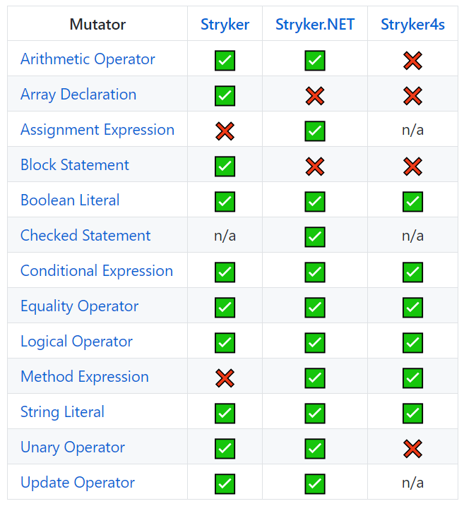

## Mutation testing

----

## Mutation testing

Warum?

- Weil Code Coverage nicht die ganze Wahrheit ist
- Qualität der Tests prüfen

----

### Grundgedanke

<ul>
    <li class="fragment" data-fragment-index="0">Änderung/Bugs in getesteten Code einbauen ("Mutanten")</li>
    <li class="fragment" data-fragment-index="1">Wenn es keinen Einfluss auf das Test-Ergebnis hat, hat der Mutant überlebt &#x1F615;</li>
    <li class="fragment" data-fragment-index="2">Wenn der Mutant einen Test fehlschlagen lässt, ist der Mutant tot &#x2713;</li>
</ul>

----

### Mutationen

----

### Demo

----

### Mutation testing frameworks

- Java: [PIT](http://pitest.org/)
- [Stryker](https://stryker-mutator.io/)
  - C#: Stryker.NET
  - Javascript
  - Scala
