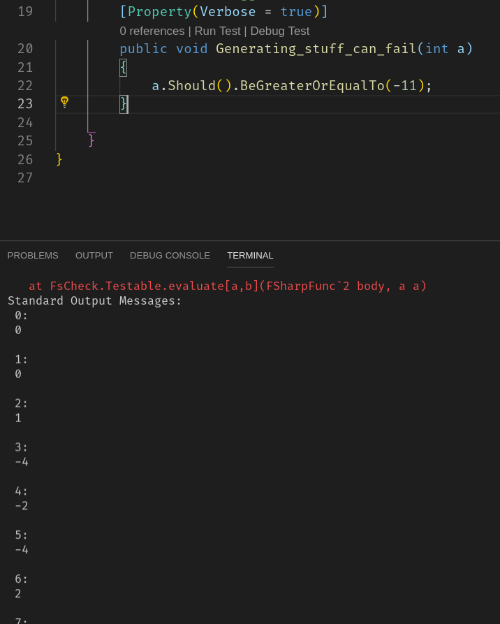
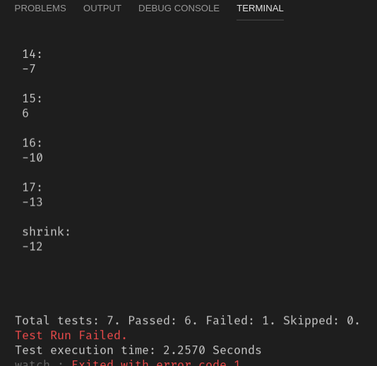
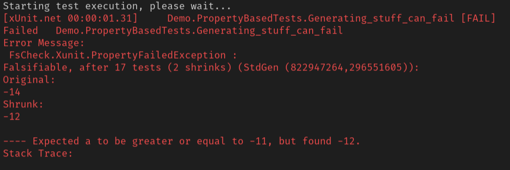

## Property Based Testing


Herkömmlicher Unit Test

```csharp
public int Add(int a, int b) => a + b;
```

```csharp
[Fact]
public void Adding_1_and_1_returns_2() =>
    Add(1, 1).Should().Be(2);
```

Nachteile: <!-- .element: class="fragment" data-fragment-index="1" -->
- es wird nur ein Fall getestet  <!-- .element: class="fragment" data-fragment-index="2" -->
- unvollständig  <!-- .element: class="fragment" data-fragment-index="3" -->

---

Parametrisierter Test

```csharp
[Theory]
[InlineData(1, 1, 2)]
[InlineData(-1, 1, 0)]
[InlineData(0, 0, 0)]
public void Adding_two_number_returns_correct_result(
    int a, int b, int expected)
{
    Add(a, b).Should().Be(expected);
}
```

Nachteil: man vergisst/uebersieht Randbedingungen <!-- .element: class="fragment" data-fragment-index="1" -->

---

Zufallsdaten verwenden

---

<!-- .slide: data-background="./images/xkcd_random_number.png" data-background-size="contain" -->

<div style="position: absolute; top: 630px; right: -16%;">
  <p class="img-src">https://xkcd.com/221/</p>
</div>

---

```csharp
[Fact]
public void Adding_2_random_numbers_should_work()
{
    var a = Randomizer<int>.Create();
    var b = Randomizer<int>.Create();

    // Dangerous!
    Add(a, b).Should().BeGreaterOrEqualTo(Int32.MinValue);
}
```

Nachteile: <!-- .element: class="fragment" data-fragment-index="1" --> 
- Man erwischt nicht alle Randbedingungen <!-- .element: class="fragment" data-fragment-index="2" -->
- Was ist der Erwartungswert ("expected")? <!-- .element: class="fragment" data-fragment-index="3" -->
---

## Property based testing

- Property: "Eigenschaft" (nicht C# Property) <!-- .element: class="fragment" data-fragment-index="1" -->
- arbeitet auch mit Zufallsdaten <!-- .element: class="fragment" data-fragment-index="2" -->
- Sinnvolle Zufallsdaten <!-- .element: class="fragment" data-fragment-index="3" -->
- Genügend Zufallsdaten <!-- .element: class="fragment" data-fragment-index="4" -->
- Falsifizierung <!-- .element: class="fragment" data-fragment-index="5" -->

---

<!-- .slide: data-background="./images/Karl_Popper.jpg" data-background-size="contain" -->

<div style="position: absolute; top: 630px; right: -16%;">
  <p class="img-src">https://commons.wikimedia.org/w/index.php?curid=9694262</p>
</div>

---

<!-- .slide: data-background="./images/Screenshot_from_2019-01-24_21-58-06_falsifikation.png" data-background-size="contain" -->

---

<!-- .slide: data-background="./images/Screenshot_from_2019-01-24_22-01-01_falsifizierung_schwaene.png" data-background-size="contain" -->

---

### Falsifizierung

- man kann nichts (!) beweisen, sondern nur falsifizieren

---

Frameworks für viele Sprachen vorhanden
- Haskell: [QuickCheck](http://hackage.haskell.org/package/QuickCheck) ("das Original")
- C# / F#: [FsCheck](https://fscheck.github.io/FsCheck/)
- Java: [junit-quickCheck](https://github.com/pholser/junit-quickcheck), [QuickTheories](https://github.com/ncredinburgh/QuickTheories), [jqvwik](https://jqwik.net/)
- Javascript/Typescript: [JsVerify](http://jsverify.github.io/), [fast check](https://github.com/dubzzz/fast-check)
- ...
  
---

#### Beispiel

```csharp
using FsCheck.Xunit;

[Property]
public void Generating_stuff_can_fail(int someNumber)
{
    someNumber.Should().BeGreaterThan(-11);
}
```

---



---



---



---

```
Falsifiable, after 17 tests (2 shrinks) 
    (StdGen (822947264,296551605)):
Original:
-14
Shrunk:
-12

---- Expected a to be greater or equal to -11, but found -12.
```

- nach 17 Zufallstests: Test schlägt fehl <!-- .element: class="fragment" data-fragment-index="1" -->
- 2 Shrinks: einfachster Datensatz, der Fehler auslößt <!-- .element: class="fragment" data-fragment-index="2" -->
- StdGen: Reproduzierbar <!-- .element: class="fragment" data-fragment-index="3" -->

---

- smarter Testdaten-Generator
- Wie kann uns das helfen die "Add" Methode zu verbessern? <!-- .element: class="fragment" data-fragment-index="1" -->
- Die Eigenschaft (Property) von "Add" muss überdacht werden <!-- .element: class="fragment" data-fragment-index="2" -->

---

```csharp
Add(a, b) == Add(b, a)                 // Commutativity
Add(a, Add(b, c)) == Add(Add(a, b), c) // Associativity
Add(a, IDENTITY) == a                  // Identity
```

---

    Let’s talk about the **Identity** property. The Identity property states that calling the function with **any value and the identity will always yield the same value**. When you think about that, the IDENTITY of Add is 0. Conversely the IDENTITY value of Mul is 1 because any number multiplied by 1 will always be that number itself. 
    
    This is what separates Add and Mul.

---

Zu mathematisch?

---

#### Beispiel: MD5

- The hash is 32 characters long.
- The hash only contains hexadecimal characters.
- Equal inputs have the same hash.
- The hash is different from its input.
- Similar inputs have significantly different hashes.

Source: http://www.erikschierboom.com/2016/02/22/property-based-testing/

---

Mit **Arbitraries** Zufallsdaten beeinflussen

---

```csharp
[Property(Arbitrary = new[] { typeof(NonNullStringArbitrary) })]
public void Dummy(string input) => input.Should().NotBeNull();
```

```csharp
[MyProperty]
public void Dummy2(string input) => input.Should().NotBeNull();
```

```csharp
public static class NonNullStringArbitrary
{
    public static Arbitrary<string> Strings() => 
        Arb.Default.String().Filter(x => x != null);
}
```

```csharp
public class MyPropertyAttribute : PropertyAttribute
{
    public MyPropertyAttribute() => 
        Arbitrary = new[] {typeof(NonNullStringArbitrary)};
}
```

---

Conditional Properties: `func.When(...)`

```csharp
[Property]
public Property Anything_divisible_by_three_but_not_five_returns_fizz(int input)
{
    Func<bool> property = () => Fizz.Buzz(input) == "Fizz";

    return property.When(input % 3 == 0 && input % 5 != 0);
}
```

---

#### Live Coding

---

#### Andere Beispiele

- [Dreieck (C#)](https://techbeacon.com/app-dev-testing/how-make-your-code-bulletproof-property-testing)
- [Stack (Scala)](https://hackernoon.com/exploring-property-based-testing-with-scalacheck-simple-examples-bcdc34600810)
- [FizzBuzz (Scala)](https://hackernoon.com/exploring-property-based-testing-with-scalacheck-simple-examples-bcdc34600810)
- [Http client (Go)](https://dev.to/quii/property-based-testing-in-real-life-4db8)


---

### Zusammenfassung

Property Based Testing ist gut für:

- Algorithmen
- alles, was keinen Zustand hat
- kann für Testdatengenerierung eingesetzt werden
- Validierungen

---

## Resources

- https://blog.gopheracademy.com/advent-2017/property-based-testing/
- http://www.erikschierboom.com/2016/02/22/property-based-testing/
- https://www.codit.eu/blog/property-based-testing-with-c/
- https://www.pluralsight.com/tech-blog/property-based-tdd

