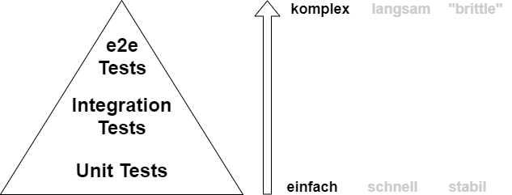
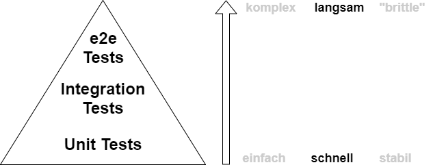
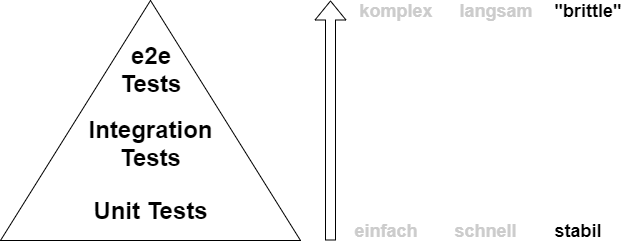
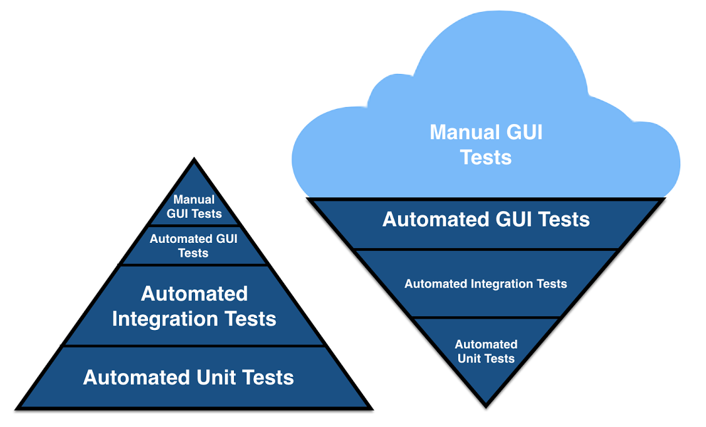
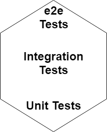

## Test Pyramide

---

----

----

---

### Antipattern: Ice Cream Cone

  
https://medium.com/@fistsOfReason/testing-is-good-pyramids-are-bad-ice-cream-cones-are-the-worst-ad94b9b2f05f

---

## Honeycomb

für Microservices

Note:

https://labs.spotify.com/2018/01/11/testing-of-microservices/